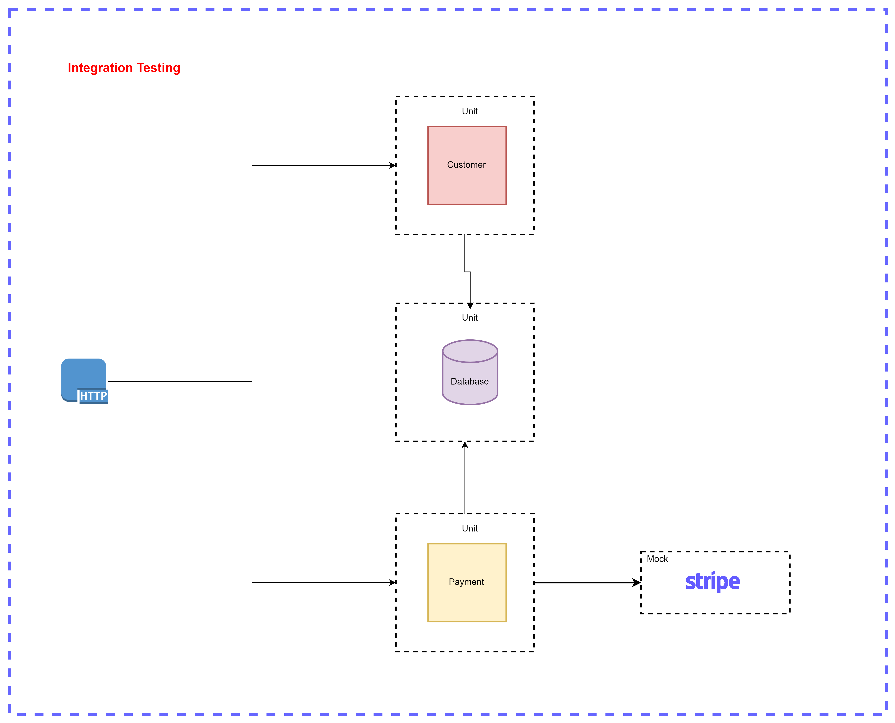

In this course you will learn everything about testing. Starling from
- Unit Testing
- Mocking with Mockito
- Integration Testing
- Testing External Services
- Integration Testing With Testcontainers

## Tracing and Monitoring with OpenTelemetry and Jaeger
